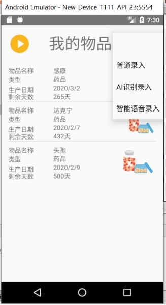

#云保质期管家Android客户端
##技术栈：JAVA+SQlite
##主页面 ：
主要负责显示用户添加的所有物品及信息，而每个单元格里则是储存已有物品的主要信息，例如物品名称，物品类型，生产日期，物品保质期，物品图片。主界面左上角则是一个分级按钮，右上角则是跳转到添加页面的按钮。

## 分类菜单
点击后会出现 化妆品，食品，药品三大预设好的分类板块，用户点击具体类别后，会只显示该类别物品  

  

 |  | 
---|---|---
&nbsp;&nbsp;&nbsp;&nbsp;&nbsp;&nbsp;&nbsp;&nbsp;&nbsp;&nbsp; 化妆品分类 | &nbsp;&nbsp;&nbsp;&nbsp;&nbsp;&nbsp;&nbsp;&nbsp;&nbsp;&nbsp;食品分类 | &nbsp;&nbsp;&nbsp;&nbsp;&nbsp;&nbsp;&nbsp;&nbsp;&nbsp;&nbsp;药品分类

## 添加方式菜单
点击录入方式，输入信息录入

## 登录
输入用户名和密码进行登录  

